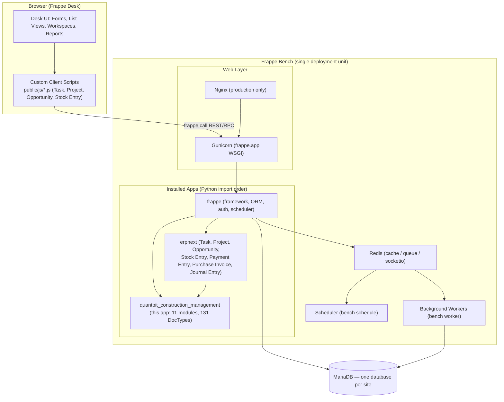
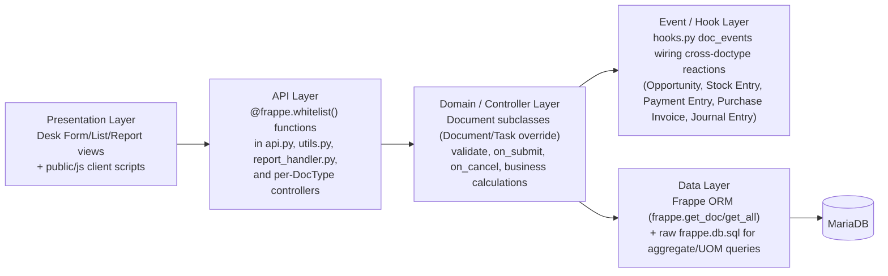
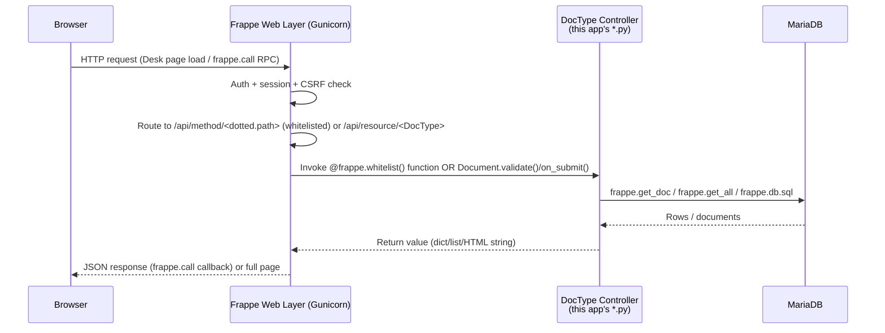

# Architecture

## System Architecture

Quantbit Construction Management is not a standalone service — it is a **Frappe app** installed into a Frappe **bench** alongside `frappe` (the framework) and `erpnext` (the base ERP). It has no separate backend server, database, or frontend build of its own; it plugs into the standard Frappe request/response pipeline, ORM, scheduler, and Desk UI.



Source basis: `quantbit_construction_management/hooks.py` (`override_doctype_class`, `doc_events`, `doctype_js`), `quantbit_construction_management/overrides/task.py`, `quantbit_construction_management/public/js/*.js`. General Frappe deployment topology (Nginx/Gunicorn/Redis/workers/scheduler) is standard `bench` architecture, not something defined inside this app's code — this repository contains no Nginx/Supervisor config files of its own (confirmed via repository search; see `docs/deployment.md`).

## Folder Structure

```
Quantbit-Construction-Management/
├── README.md                       # App-level readme (bench install instructions)
├── license.txt                     # MIT license text
├── pyproject.toml                  # Python packaging + ruff config
├── .pre-commit-config.yaml         # pre-commit hook definitions
├── .eslintrc                       # JS lint rules
├── docs/                           # This documentation set
└── quantbit_construction_management/   # The installable Frappe app package
    ├── __init__.py                 # __version__ = "0.0.1"
    ├── hooks.py                    # App manifest: hooks, fixtures, doc_events, doctype_js
    ├── api.py                      # Whitelisted RPC endpoints (Task hierarchy operations)
    ├── utils.py                    # Shared helpers (UOM conversion, unique number generator)
    ├── report_handler.py           # Whitelisted helper to render a Query Report as HTML
    ├── modules.txt                 # Declares the 11 Frappe "Module Def" names
    ├── patches.txt                 # Migration patch registry (currently empty sections)
    ├── overrides/
    │   └── task.py                 # CustomTask(Task) — overrides ERPNext's Task.validate_status
    ├── fixtures/                   # Exported fixture data (Roles, Workflow*, Custom Field, Property Setter, UOM*, Accounting Dimension, Item Type, Contract Type)
    ├── config/                     # Desk module config (__init__.py only)
    ├── desktop_icon/               # Desk "Module" home-page icons (JSON)
    ├── templates/                  # Website template package (empty __init__.py files only)
    ├── public/
    │   ├── js/                     # doctype_js client scripts (Project, Task, Opportunity, Stock Entry)
    │   └── pythonn/                # Ad-hoc/standalone Python scripts (see docs/known-limitations.md)
    ├── quantbit_construction_management/   # The "core" Frappe module (Module Def = app name)
    │   ├── doctype/                 # 21 core DocTypes (Site, Costing, Equipment, Worker Master, ...)
    │   ├── module_onboarding/       # Module onboarding definition ("construction")
    │   ├── onboarding_step/         # Onboarding step ("create_item")
    │   └── workspace/               # Desk workspaces: Bill Of Quantity, CMS, QC, Safety, Tendaring
    ├── billing/doctype/             # Module declared, no DocTypes implemented yet
    ├── boq/                         # BOQ module: 5 DocTypes + 2 Query Reports
    ├── document_control/            # 6 DocTypes (drawings, RFI, transmittals)
    ├── labour_management/           # 8 DocTypes (gangs, skills, attendance)
    ├── progress_measurement_&_billing/  # 7 DocTypes (progress claims/certificates)
    ├── quality_and_safety_management/   # 15 DocTypes (inspections, NCR, risk, safety)
    ├── ra_billing/                  # 10 DocTypes (RA bill sheets, bulk RA billing)
    ├── site_diary/                  # 17 DocTypes + custom/, custom_stock/, report/
    ├── subcontractor_management/    # 14 DocTypes (contractor, SC bill, RA billing, agreements)
    ├── tendering/                   # 24 DocTypes + custom/, custom_crm/, custom_project/
    └── workspace_sidebar/           # Sidebar JSON configs mirroring the workspaces above
```

Source: repository directory listing (`find` of the working tree) and `quantbit_construction_management/modules.txt`.

## Module Boundaries

Each entry in `modules.txt` maps 1:1 to a `Module Def` DocType record and to a top-level folder under `quantbit_construction_management/quantbit_construction_management/`'s sibling directories (Frappe convention: `app/<module_name_snake_case>/doctype/<doctype_name_snake_case>/`). DocTypes declare their owning module in their `.json` (`"module": "..."`), which is how Frappe groups them in the Desk module list and in `bench export-fixtures`/migrations.

Two modules extend **ERPNext DocTypes in place** rather than declaring brand-new ones:
- `tendering/custom_crm/opportunity.py` and `tendering/custom_project/project.py` — hook logic and whitelisted methods layered onto ERPNext's `Opportunity` and `Project`.
- `site_diary/custom_stock/stock_entry.py` — hook logic layered onto ERPNext's `Stock Entry`.
- `overrides/task.py` — a full Python class override of ERPNext's `Task` via `override_doctype_class` in `hooks.py:24-26`.

This means module boundaries in this codebase are **logical/organizational** (by business capability) rather than strict technical boundaries — several modules reach into the same underlying DocTypes (e.g., both `tendering` and the core module manipulate `Task`; both `subcontractor_management` and `ra_billing` model "RA Billing" concepts under different DocType names — see `docs/known-limitations.md` for the naming-collision risk this creates).

## Layered Architecture



There is no separate service layer package (no `services/` directory was found); business logic lives directly in DocType controllers (`<doctype>.py`) and in the small set of module-level utility files (`api.py`, `utils.py`, `report_handler.py`).

## Request Lifecycle

A typical Desk interaction (e.g., opening the `Site Diary` form and clicking a custom button) follows the standard Frappe request lifecycle; this app only supplies the endpoints and controller logic, not the transport:



Example concrete path: `Project.js` calls `frappe.call({method: "quantbit_construction_management.api.link_boq_tasks_to_project", ...})` → Frappe resolves the dotted path to `api.py:link_boq_tasks_to_project` → the function runs a raw `UPDATE` via `frappe.db.sql` and commits (`quantbit_construction_management/api.py:60-71`).

## Event Lifecycle

Two event mechanisms are used in this app:

1. **Frappe document events wired centrally in `hooks.py`** (`doc_events` dict, `hooks.py:284-302`) — these fire automatically whenever the named ERPNext DocType transitions through the given event, regardless of which module triggered the change:

```mermaid
graph TD
    Opp["Opportunity.on_update"] --> OppHandler["tendering.custom_crm.opportunity.on_update"]
    SE["Stock Entry.on_submit"] --> SEHandler["site_diary.custom_stock.stock_entry.update_task_material_cost"]
    PE_submit["Payment Entry.on_submit"] --> CB1["subcontractor_management...contractor_billing.on_payment_entry_submit"]
    PE_cancel["Payment Entry.on_cancel"] --> CB2["subcontractor_management...contractor_billing.on_payment_entry_cancel"]
    PI["Purchase Invoice.on_update"] --> CB3["subcontractor_management...contractor_billing.on_purchase_invoice_update"]
    JE["Journal Entry.on_update"] --> CB4["subcontractor_management...contractor_billing.on_journal_entry_update"]
```



   Source: `quantbit_construction_management/hooks.py:284-302`. See `docs/backend.md` and `docs/integrations.md` for what each handler does.

2. **Per-DocType lifecycle methods** implemented directly on each Document subclass (`validate`, `before_save`, `on_submit`, `on_cancel`, etc.), following standard Frappe Document API conventions. These are documented per-DocType in `docs/doctypes.md`.

No `scheduler_events`, `before_request`/`after_request`, or `before_job`/`after_job` hooks are registered — those blocks exist in `hooks.py` only as commented-out templates (`hooks.py:304-323`, `361-369`). See `docs/scheduler-and-background-jobs.md`.

## Diagrams

Additional diagrams (entity relationships, workflow state machines) are in `docs/diagrams.md`, `docs/database.md`, and `docs/workflows.md`.
