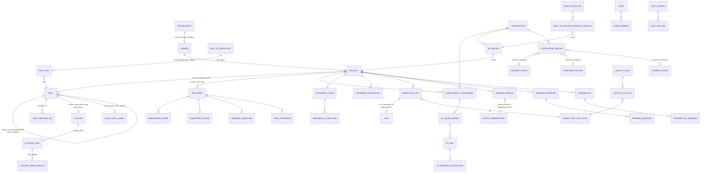
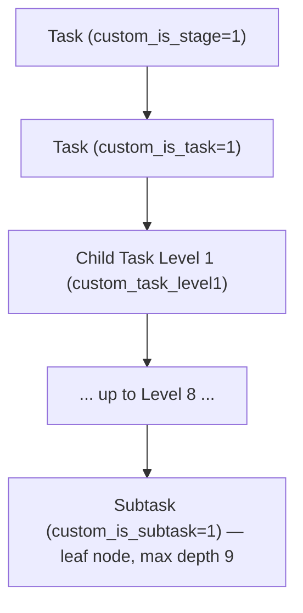

# Database

This app has **no dedicated database layer of its own** — it relies entirely on the Frappe ORM. Every DocType `.json` file is compiled by Frappe into a MariaDB/Postgres table (`tab<DocType Name>`), and every Link/Table field becomes a foreign-key-like relationship enforced at the application layer (Frappe does not create SQL `FOREIGN KEY` constraints by default). Raw `frappe.db.sql` is used in a handful of places for aggregation/reporting (see `docs/reports.md`, `docs/backend.md`) rather than as the primary data-access pattern, which is `frappe.get_doc`/`frappe.get_all`/`frappe.get_list`.

## Entity Relationships (High-Level)

This diagram covers the dominant relationships found across `docs/doctypes.md`; it intentionally omits many secondary Link fields (currency/company/UOM links to ERPNext masters, etc.) for readability. Every relationship shown is a **Frappe Link field** (application-level reference, `options: "<Target DocType>"`), not a SQL foreign key.

## Parent-Child (Table) Relationships

Frappe child tables (`istable: 1`) are physically separate tables (`tab<Child DocType>`) linked back to their parent via the implicit `parent`/`parenttype`/`parentfield` columns Frappe adds to every child-table DocType — this app does not override that mechanism anywhere. Representative parent → child pairs found in `docs/doctypes.md` (not exhaustive — see each DocType's "Child Tables" section for the full list):

| Parent | Child Table(s) |
|---|---|
| Bill of Quantities | BOQ Item |
| Costing | Costing Task → Costing Work Details (two levels deep) |
| Tender | Bid Submission Checklist Details, Pre/Post Bid Checklist Details, Technical/Financial Qualification Details, Tender Item, Tender Documents, Tender Confidential Documents (`permlevel 4`), Tender Competitor Details, Tender Corrigendum, Costing Sheet Details, Deliverable Details, Sales Recommendation Details, Task BOQ Details |
| Equipment Usage | Equipment Usage Details → Equipment Usage Disel Details |
| Manpower Usage | Manpower Usage Details |
| Task Progress | Task Progress Details → Task Progress Image |
| RA Billing (subcontractor_management) | RA Billing Details, RA Abstarct Details (sic — misspelled in source), RA Billing Tax Details |
| Bulk RA Billing | Bulk RA Billing Projects Details, Bulk RA Bill Tax Details |
| Task Level Sheet | Task Level Sheet Details, Level Task Details |
| SC Work Order | WO Item |
| SC Bill | SC Bill Item |
| Contractor Billing | Contractor Billing Details |
| Progress Claim | Progress Claim Item, Cert Deduction, Claim Included VO, Disputed BOQ Item |
| Quality Plan | Quality Plan ITP |
| Inspection Test Plan | ITP Item |
| Inspection Lot | Inspection Result |
| Incident Report | Incident CA |
| Risk Register | Risk Item |
| Toolbox Talk | JBT Attendee |
| Gang | Gang Member |
| Skill Matrix | Skill Record |
| Labour Attendance Bulk Entry | Labour Attendance Row |
| Transmittal | Transmittal Drawing |
| Costing (core) / Material Costing / Equipment Costing / Worker Costing | Material Details, Work Details, Labour Entry Details (shared master-detail child tables reused across several parent doctypes) |

## Link Fields to ERPNext Core

Because this app is layered on ERPNext, a large share of Link fields across `docs/doctypes.md` point at ERPNext DocTypes rather than doctypes defined in this app: `Project`, `Task`, `Customer`, `Lead`, `Item`, `Employee`, `Company`, `Currency`, `UOM`, `Warehouse`, `Payment Entry`, `Purchase Invoice`, `Journal Entry`, `Sales Invoice`, `Item Price`, `Stock Entry`. This is the primary technical coupling between this app and ERPNext beyond the explicit `hooks.py` wiring described in `docs/architecture.md`.

## The Task Hierarchy (Central Data Model)

The single most important structural pattern in this codebase is a **deep self-referential Task hierarchy**, layered onto ERPNext's standard `Task.parent_task` field via custom fields, and reused by nearly every module:

- `custom_is_stage` / `custom_is_task` / `custom_is_subtask` flags (plus implicit "child task level N" depth) distinguish node roles within the same `Task` doctype — there is no separate "Stage" or "Subtask" DocType.
- `task_weight` (Float, percentage) on every node must sum to ≤100% among siblings — enforced **client-side only** in `Project.js` (`validate_total_weight`/`validate_task_weight`/`validate_subtask_weight`), not in any Python controller.
- `progress` rolls up weighted-average from children to parent, computed **client-side** in `Project.js`'s `calculate_progress()` (writes back via `frappe.client.set_value`) and **server-side** in `Daily Progress Tracking`'s `update_parent_progress` (core module) — two independent roll-up implementations exist; see `docs/known-limitations.md`.
- Cost roll-ups (`custom_total_labour_cost`, `custom_total_equipment_cost`, `custom_total_material_cost`) are summed bottom-up the same tree, again computed client-side in `Project.js` (`compute_costs`) as well as server-side via `Costing`'s engine and `stock_entry.update_task_material_cost`.
- Many child tables across Site Diary, Subcontractor Management, and RA Billing carry a **flattened copy** of this hierarchy as `task_level1`…`task_level10` (+ matching `level{N}_subject`) fields, letting SQL joins reconstruct hierarchy position without recursive CTEs (MariaDB's traditional lack of recursive query ergonomics is the likely reason for this denormalized pattern).

## Naming Strategy

Naming rules extracted from every DocType's `autoname` (see `docs/doctypes.md` for the exact rule per DocType):

| Pattern | Example DocTypes | Notes |
|---|---|---|
| `naming_series:` (Prompt/Series) | Tender (`Tender-.YYYY.-`), BOQ (`BOQ-.YYYY.-.####`), Drawing Register (`DRG-.YYYY.-`), Subcontract Agreement (`SCA-.YYYY.-`), SC Work Order (`WO-.YYYY.-`), SC Payment Certificate (`SCPC-.YYYY.-`), SC Bill (`SCB-.YYYY.-`), Contractor Billing (`CB-`), RA Billing (`RAB-`), Progress Certificate (`PCERT-.YYYY.-`), Progress Claim (`PC-.YYYY.-`), Earned Value Record (`EVR-.YYYY.MM.-`), Task Level Sheet (`TLS-`), and most other submittable documents | Dominant pattern for submittable/transactional documents |
| `field:<fieldname>` | Site (`field:site_name`) | Name = value of a specific field |
| Autoincrement (`autoincrement`) | Several master/log doctypes (per `docs/doctypes.md`) | Simple integer sequence |
| Hash/prompt default (no `autoname` set) | Many child tables and a handful of standalone log doctypes (e.g. BOQ Amendment Log) | Frappe default: random hash or user-prompted name |
| Secondary human-readable ID via `generate_unique_8_digit_number()` | `SC Bill.bill_no`, `SC Work Order.wo_no`, `SC Payment Certificate.cert_no`, `Subcontract Agreement.sca_no`, and Document Control doctypes (Drawing Register, RFI, Shop Drawing, Transmittal) | A shared helper in the app-root `utils.py` (`quantbit_construction_management/utils.py:5-17`) generates an 8-digit random number, checked for uniqueness via `frappe.db.exists`, and set on a secondary Data field (not the document's `name`) in `before_insert` — the document's actual Frappe `name` is still governed by its `naming_series`. |
| No autoname (child tables) | All `istable: 1` DocTypes | Child rows are named by Frappe's internal row-hash mechanism; not user-facing |

## Indexes

No explicit custom indexes (`add_index`, `db_index` field flags set at the Python level) were found in this app's source. At the schema (JSON) level:
- **42 fields** across the app set `"unique": 1` (Frappe auto-creates a unique index for these).
- **27 fields** set `"search_index": 1` (Frappe creates a plain index to speed up "Search Field" lookups in Link fields / global search).

Beyond these JSON-declared flags, indexing is whatever Frappe applies automatically (primary key on `name`, indexes on Link fields' target columns via `search_index` where set, and implicit indexes Frappe adds for `parent`/`parenttype`/`parentfield` on every child table). **Not found in repository**: any custom composite indexes, full-text indexes, or manually-tuned index strategy for the app's heavier aggregate queries (e.g., the raw SQL in `docs/reports.md` and the RA Billing engine) — see `docs/known-limitations.md` for the performance implications of joining/grouping over child tables like `Equipment Usage Details`/`Manpower Usage Details` at scale without dedicated indexes beyond Frappe's defaults.

## Accounting Dimension

The `Site` DocType (core module) is registered as an ERPNext **Accounting Dimension** (`fieldname: "site"`, `document_type: "Site"` — `quantbit_construction_management/fixtures/accounting_dimension.json`), installed via the `fixtures` hook (`hooks.py:54-62`). This makes `site` available as a dimension field on standard ERPNext GL-impacting documents (Journal Entry, Payment Entry, Sales/Purchase Invoice, etc.) once the fixture is applied — connecting this app's site-level data model into ERPNext's accounting/reporting dimension system without a code-level integration.
