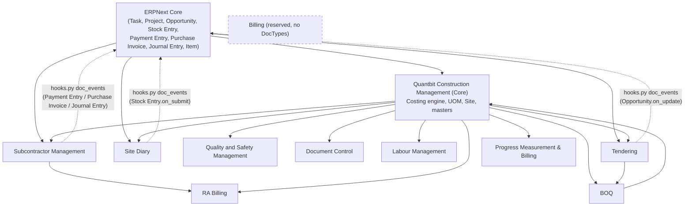
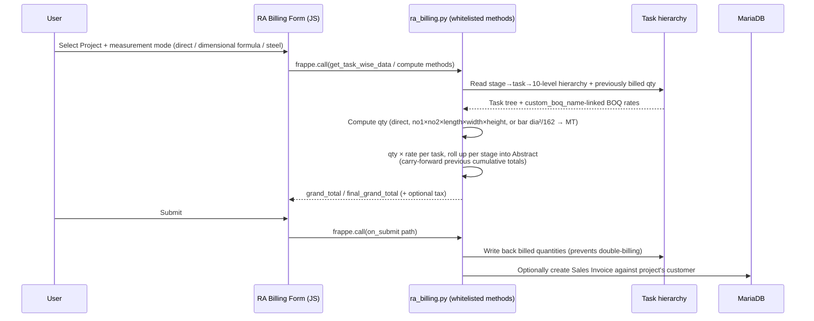
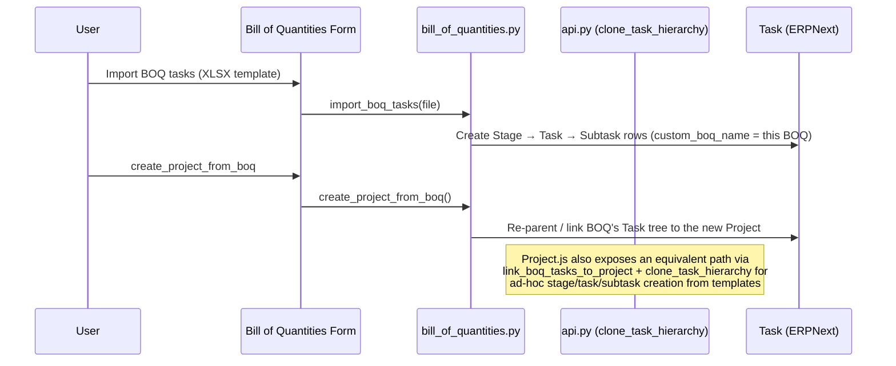

# Diagrams

This page indexes every diagram in the documentation set and adds one cross-cutting diagram (module dependencies) not shown elsewhere. All diagrams are Mermaid and render directly on GitHub/most Markdown viewers.

## Index

| Diagram | Location | Shows |
|---|---|---|
| System architecture | `docs/architecture.md#system-architecture` | Bench/app/process topology |
| Layered architecture | `docs/architecture.md#layered-architecture` | Presentation → API → Controller → Hook → Data layers |
| Request lifecycle | `docs/architecture.md#request-lifecycle` | Sequence diagram of a Desk `frappe.call` round-trip |
| Event lifecycle | `docs/architecture.md#event-lifecycle` | `hooks.py` `doc_events` wiring graph |
| Construction lifecycle | `docs/workflows.md#construction-lifecycle-end-to-end` | Opportunity → Tender → Project → execution modules |
| Tender Creation workflow | `docs/workflows.md#approval-flow-1-tender-creation-on-opportunity` | State machine (Opportunity) |
| Tender Submission workflow | `docs/workflows.md#approval-flow-2-tender-submission-on-tender` | State machine (Tender) |
| Entity relationships | `docs/database.md#entity-relationships-high-level` | Cross-module ER diagram |
| Task hierarchy | `docs/database.md#the-task-hierarchy-central-data-model` | Self-referential Stage/Task/Subtask tree |

## Module Dependency Graph

Derived from the Link-field and hook relationships documented in `docs/modules.md` and `docs/architecture.md`:

Solid arrows = Link-field or explicit API dependency (source module reads/writes target module's DocTypes). Dashed arrows = `hooks.py` `doc_events` reacting to an ERPNext-core event. `Billing` is dashed/empty because it declares no DocTypes (see `docs/modules.md#billing`).

## RA Billing Computation Flow (Sequence)

Illustrates how a subcontractor RA bill is produced, based on `subcontractor_management.RA Billing`'s whitelisted methods (`docs/modules.md#subcontractor-management`, `docs/doctypes.md`):

## BOQ → Project Conversion Flow

