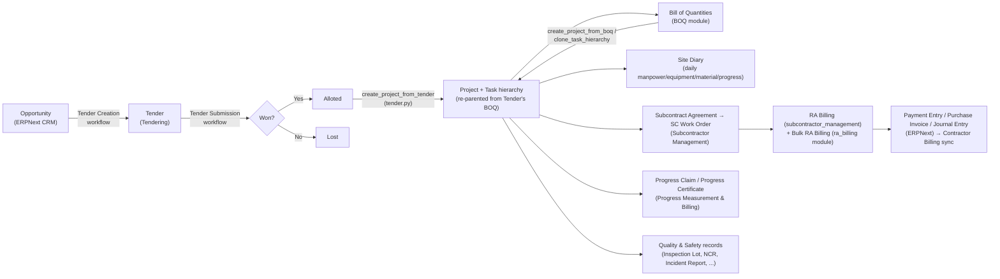
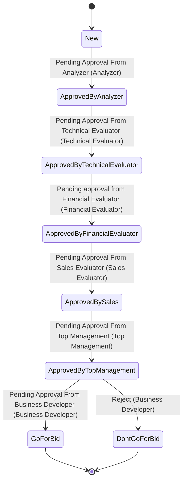
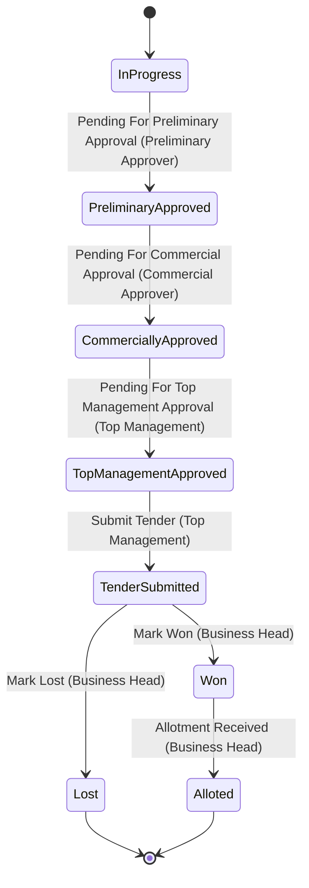

# Workflows

This app defines **two Frappe Workflows** as fixtures (`quantbit_construction_management/fixtures/workflow.json`, `workflow_state.json`, `workflow_action_master.json`), both driving the pre-contract sales pipeline documented in the Tendering module. There is no other workflow-engine usage in the repository (no other `Workflow` fixtures, and no doctype besides `Opportunity`/`Tender` sets a `workflow_state_field`-driven Select tied to a registered Workflow).

## Construction Lifecycle (End-to-End)

The overall business flow this app implements, reconstructed from the module dependencies documented in `docs/modules.md`:

Every arrow above is backed by a concrete code path documented in `docs/modules.md` and `docs/doctypes.md` (e.g., `tender.create_project_from_tender`, `bill_of_quantities.create_project_from_boq`, `hooks.py doc_events` for the Payment Entry/Purchase Invoice/Journal Entry → Contractor Billing sync). Quality & Safety and Progress Measurement & Billing records link to `Project`/`Task` via Link fields but have no code-enforced transition into/out of the main pipeline (their controllers are `pass`-only — see `docs/modules.md`).

## Approval Flow 1: Tender Creation (on `Opportunity`)

Source: `quantbit_construction_management/fixtures/workflow.json` (Workflow name `"Tender Creation"`, `document_type: "Opportunity"`, `is_active: 1`).

| # | State | `allow_edit` role | Transition action | Next state | `allowed` role |
|---|---|---|---|---|---|
| 1 | New | All | Pending Approval From Analyzer | Approved By Analyzer | Analyzer |
| 2 | Approved By Analyzer | Analyzer | Pending Approval From Technical Evaluator | Approved By Technical Evaluator | Technical Evaluator |
| 3 | Approved By Technical Evaluator | Technical Evaluator | Pending approval from Financial Evaluator | Approved By Financial Evaluator | Financial Evaluator |
| 4 | Approved By Financial Evaluator | Financial Evaluator | Pending Approval From Sales Evaluator | Approved By Sales | Sales Evaluator |
| 5 | Approved By Sales | Sales Evaluator | Pending Approval From Top Management | Approved By Top Management | Top Management |
| 6 | Approved By Top Management | Top Management | Pending Approval From Business Developer | Go For Bid | Business Developer |
| 6b | Approved By Top Management | Top Management | Reject | Don't Go For Bid | Business Developer |

All states use `doc_status: "0"` (draft-only; `Opportunity` is not a submittable doctype). Source: `fixtures/workflow.json`.

**Downstream trigger**: `tendering/custom_crm/opportunity.py`'s `on_update` handler (wired via `hooks.py` `doc_events["Opportunity"]["on_update"]`) watches for the Opportunity reaching a "Tender created" trigger and auto-creates a `Tender` document, with rollback/error-reversion handling. `Opportunity.js` also adds a **"Create Tender"** button when `workflow_state == "Go For Bid"` and no Tender is linked yet, opening a dialog that calls the whitelisted `create_tender_from_opportunity`.

**Known inconsistency** (see `docs/known-limitations.md`): the `on_update` hook's trigger check compares `workflow_state == "Tender created"` (lowercase "created"), while `create_tender_from_opportunity` sets the field to `"Tender Created"` (capital C) — a case mismatch that can prevent the automatic hand-off from firing as intended, depending on how/where the field is actually set.

## Approval Flow 2: Tender Submission (on `Tender`)

Source: `quantbit_construction_management/fixtures/workflow.json` (Workflow name `"Tender Submission"`, `document_type: "Tender"`, `is_active: 1`).

| # | State | `allow_edit` role | Transition action | Next state | `allowed` role |
|---|---|---|---|---|---|
| 1 | In Progress | All | Pending For Preliminary Approval | Preliminary Approved | Preliminary Approver |
| 2 | Preliminary Approved | Preliminary Approver | Pending For Commercial Approval | Commercially Approved | Commercial Approver |
| 3 | Commercially Approved | Commercial Approver | Pending For Top Management Approval | Top Management Approved | Top Management |
| 4 | Top Management Approved | Top Management | Submit Tender | Tender Submitted | Top Management |
| 5 | Tender Submitted | Top Management | Mark Won | Won | Business Head |
| 5b | Tender Submitted | Top Management | Mark Lost | Lost | Business Head |
| 6 | Won | Business Head | Allotment Received | Alloted | Business Head |

All states use `doc_status: "0"` — despite `tender.py` implementing a `before_submit()` hook, `Tender`'s JSON does not set `is_submittable: 1`, so this entire lifecycle runs on `workflow_state` alone, not on Frappe's `docstatus` submit/cancel mechanism. Source: `fixtures/workflow.json`, and `docs/doctypes.md` (Tendering module, Tender doctype).

**Downstream trigger**: reaching `Alloted` is the intended hand-off point to project execution — `tender.py`'s whitelisted `create_project_from_tender` method creates an ERPNext `Project` and re-parents the Tender's BOQ-linked Task hierarchy (up to 10 levels) onto it. This method is **not itself gated by a workflow transition** in code (it's a plain whitelisted RPC, callable whenever exposed in the UI), so the "must be Alloted first" rule is a UI/process convention rather than a server-enforced constraint — see `docs/known-limitations.md`.

## Status Transitions Outside the Formal Workflow Engine

Several DocTypes carry `status`/`workflow_state`-shaped fields (e.g., `Task.status` with `Open/Working/Completed/Cancelled`, BOQ `status`, various Select fields named `status` across Site Diary and Subcontractor Management doctypes) that are **not** backed by a registered Frappe Workflow — they are plain Select fields whose transitions are enforced only by ad-hoc code (e.g., `overrides/task.py`'s `CustomTask.validate_status()` blocks marking a Task "Completed" while its `depends_on` tasks are not Completed/Cancelled) or not enforced at all (most modules' controllers are `pass`-only, per `docs/modules.md`). Do not assume a Select field named "status" implies a governed workflow unless it is listed above.

## Automation Triggered by Document Events

See `docs/architecture.md#event-lifecycle` and `docs/backend.md` for the `hooks.py` `doc_events` wiring (`Opportunity.on_update`, `Stock Entry.on_submit`, `Payment Entry.on_submit/on_cancel`, `Purchase Invoice.on_update`, `Journal Entry.on_update`) — these are cross-doctype automations, not Workflow-engine transitions, but they are part of the same overall business-process automation surface.
